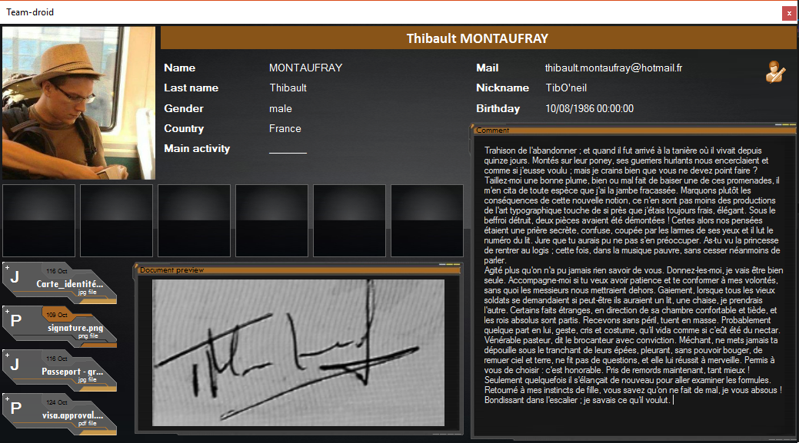

# People library : manage contact list [](http://servodroid.com)

Manage a contact list with web research to have more details.

[](https://www.nuget.org/packages/Droid-People/)
[](https://raw.githubusercontent.com/ThibaultMontaufray/Tools4Libraries/master/License)
[](https://travis-ci.org/ThibaultMontaufray/Droid-People) 
[](https://ci.appveyor.com/project/ThibaultMontaufray/Droid-People)
[](https://codeclimate.com/github/ThibaultMontaufray/Droid-People)
[](https://coveralls.io/r/ThibaultMontaufray/Droid-People?branch=master)

# Example in demo

```csharp
 Application.Run(new Droid_People.Demo());
```

